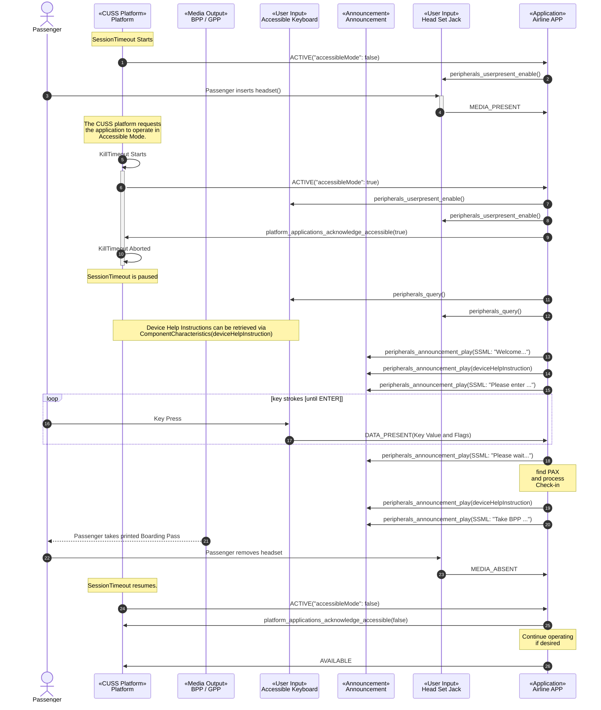
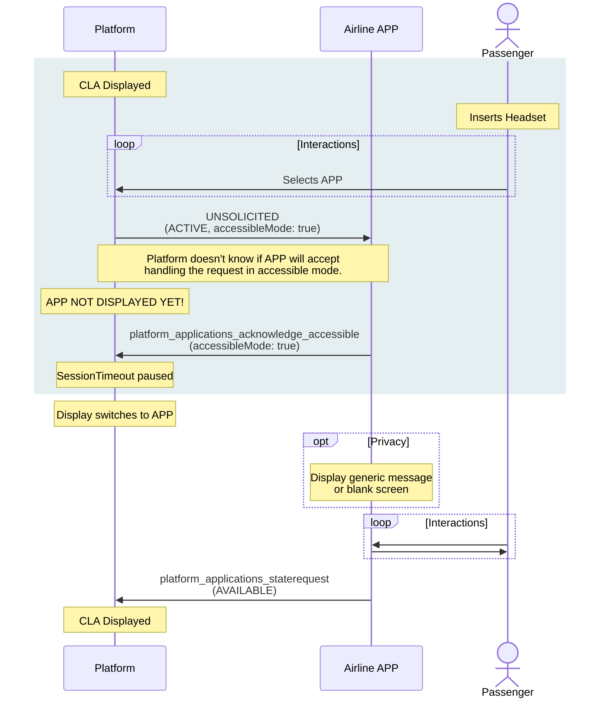
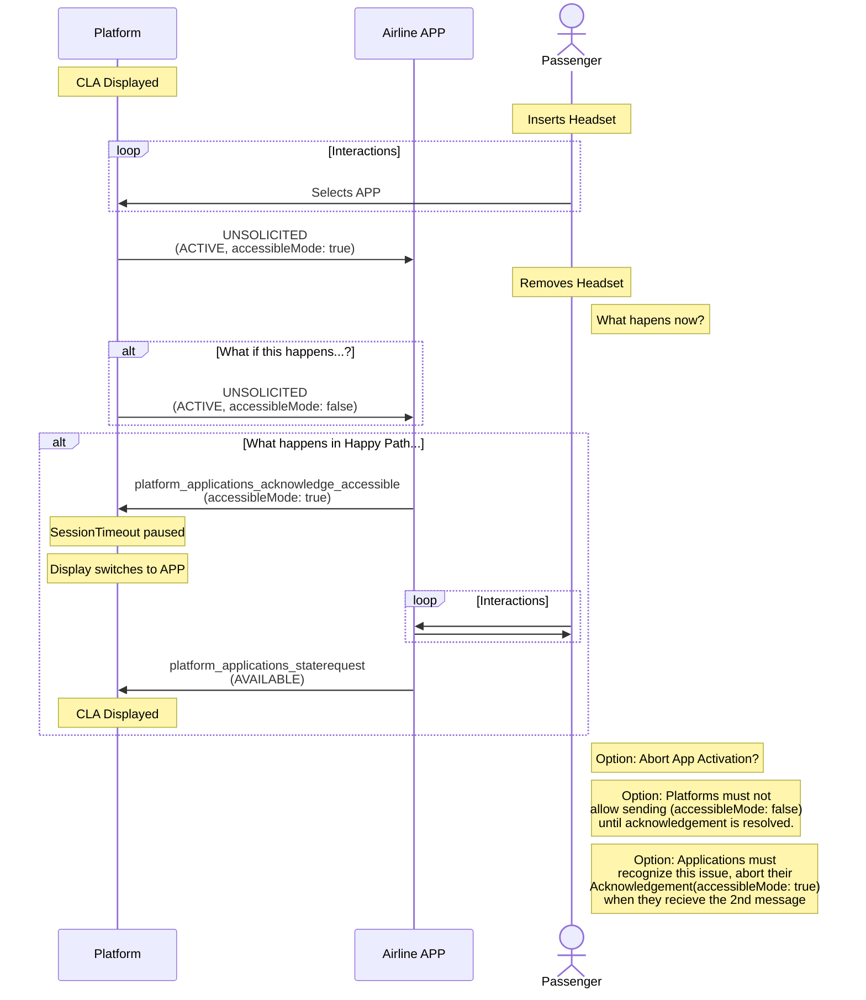
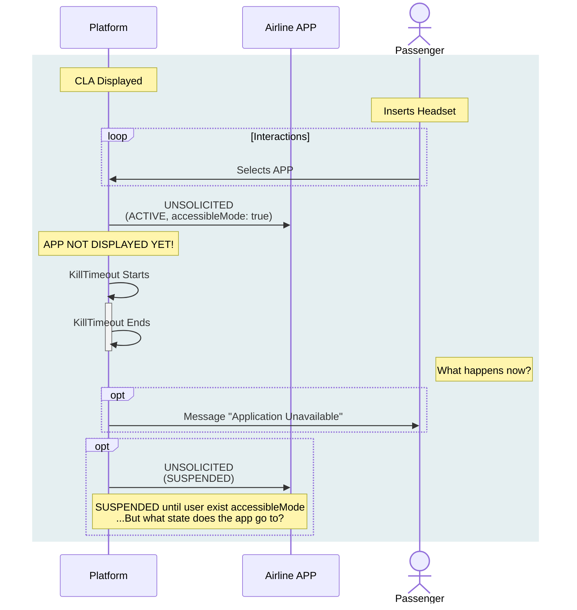
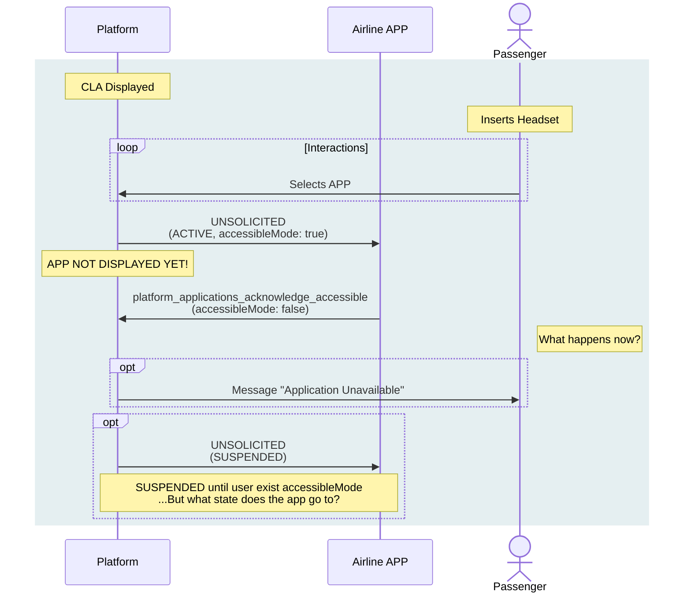
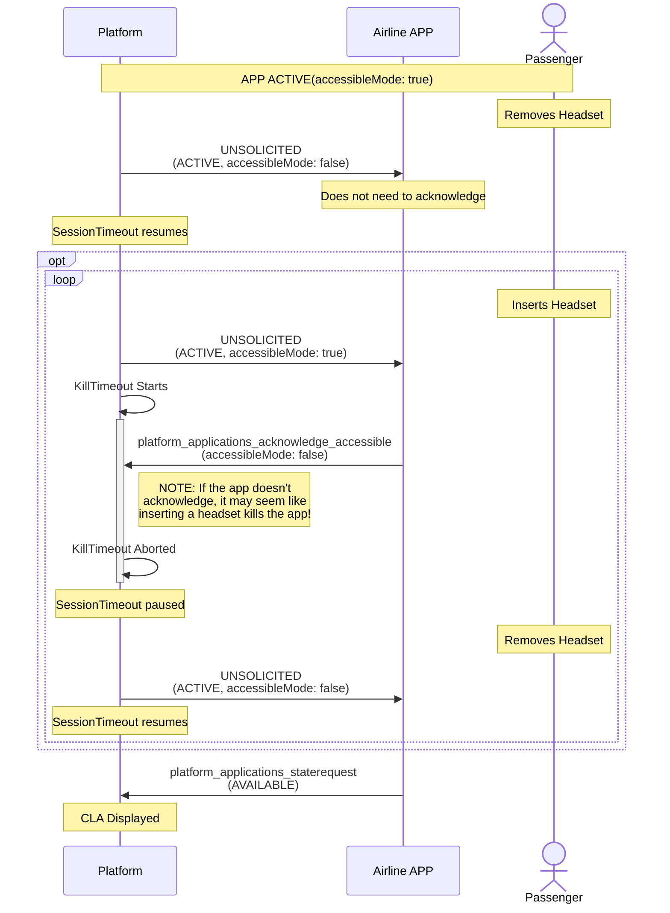

# Accessible Mode Transaction



## Scenarios for CLA activation

### Happy Path

[View on mermaidchart.com](https://www.mermaidchart.com/play#pako:eNqdU9Fq20AQ_JWNX5qAG-KHvohiUC1BBKojsBsIBMz5tJGPnO6ut-eYUPrvXUm2pVYhhN6DELrdndmZ0a-JtCVOognhzz0aiYkSlRf1owE-TvigpHLCBCi0CE_W1yDo_D6uip1rCmLltTIIcVF0NUIG66EQRGgq9I-m--xRBvDVVlzeTGF20zxmX6ZwPbvq7pc2INgX9GfICBZ5DIkip8Urll3ZP6UnlAgyQ-gDwS2KkjD01dpax7cBPTNT1lB_1ZzziM_zeY-8Qs18qd-qOWjK0zZt57GaG1mLCH4sV3d5tsjWafJ16-eX8WKd3adTFkQikdpq_M4GRBD8Hq-Gg8arT9uBZx9Ki2Q-BXg29gDqqWEFB6V1O9qFBm0nTMk-VBB2yFqzwxRAmQE41Ix-_R5q1A5e3q0hyVZFHj-kCTyk64shVyb2l1Du-LYRzmklRavwRsiGqsaywk3PoFXlP9Ro7OAWa9aqRrsPHMM9nQIxMOWtzmN8gA4qyB0SBNuZ2rVYx3H36kXI17cYtDacRlRo0CsJNZMRVbsNB32rhXkGkh7RjBi9k71h7lqYkcZ9tkdzP-YCBcHIXRa6RN7HWR5_y9OP_nOT338AckZiZQ)



### ISSUE: Headset removed before application acknowledges

[View on mermaidchart.com](https://www.mermaidchart.com/play#pako:eNqdVMGO2jAQ_ZURp12p5dBjVIFSQFokdhcVur0gIeMMibWOnXocEK367x0nQAILCDUny37j9-b5Tf50pE2wE3UIf5VoJA6VSJ3IFwb4K4TzSqpCGA9TLfzauhwEHdcfUXFRBECsnFYGIZ5Oa4yQ3jqYCiI0KbqFqbdfrEewG3THKyMYTGIYKiq02GHyAXa4IYKxIXSe4AlFQuhrpLa24BOPjhmVNVRvh-9Y-rnXa9hmqFHyLUelaJKDugOKC7ivCH68zF4n48F4Php-XbneQzyYj99Gn7g5iURqpfGZzYzAuxIfL7TYaP-OOW-daa-QTqWZB7tuo39mwkMmCjQExm77e0u1r0_UGnymKCACpNvt9ltd_2cPa6EpNHFmyZF0TwbKwBMvd6zXZ0zdMDPdidPFfrVkuFZSVM-zFPKdW9KYpLhsNFTSbtp6LT2zUGLNXOVoS8_ZLOmQomsl-7ABbZWXGb-Kt3Uc2lw3gnUersrn0-O9F82TNsctc-93jbxgJWFkydfP-BaPJ_G3yejxdq8Xhqsl4GoCX4vAG0G8sq4e8phd2FRq-nfWHkQQ5CV5DnKlXGhtt8DYRJkUHi7HMABL45WGVlxy5P8Nx94hWb3BpHtvDy0jKynhdofSpkb9xnqUFFGJPBRVuz5D5QIoPiW_HNAA3GZoQtmOxUmFm3ArwheTQM4FIsWF6fz9B6fR2Y0)



## Scenarios for all activation methods

### App does not acknowledge

[View on mermaidchart.com](https://www.mermaidchart.com/play#pako:eNqNklFr20AMx7-K5qeWpaF52IsZKV5smGmaGuy0FPKi2KpzcLlzT3K7Mfbdd07aOEsNrR7Mcae__tJP_hOUtqIgDJieWjIlxQprh9uVAR8NOlGlatAIZBrl0botIB_O77OipukSIuW0MgRRlu1zsBTrIENmMjW5ldlfOyoFXL3Gs8sRTC67z-TbCMaT8_17FwsrBPaZ3ME2hNk8glhxo_E3VYOpb04hpIbJCcNPwopJ-mxtbeNfhZzvTlnD_VMXhxIX02nvnJP2PXM_WRdkqreJdsrXbC_0PEJYLvLbeTpLiyT-vnbTs2hWpHfJyEMpiVmtNd34JYQgrqUPBve2sLgtIE7zbB49JDE8JMWXQeuvvepaaV2oLdlWIBe_Lh5UXAwrElPxSVdO1RsB-3jM-X6DAhtsGjIMxr5cHSOxjZzQ7W2Patx4HlgTrAIPTqsSu73A0uAzKo0e1Co4of4Zg8El5Ms8SxZxEp__r3tPfQS7AgcBtEaUhtb_VkC_FMvJIrvy4_H4h0f30jFhQV-yssQgGwJPCGoLYq8GRtkdgr__ANwYHfo)



### App says it cannot handle accessibleMode: true

[View on mermaidchart.com](https://www.mermaidchart.com/play#pako:eNqNUlFL40AQ_itzeVKoxT7cS5BKrgkYqDWQVhEKZZpM0-XW3b3diXoc_nc3aW1qLJzzEIadme_75pv8CwpdUhAGjv7UpAqKBVYWn5YKfBi0LAphUDFkEnmj7ROgO-RfuyJjmoZIWCkUQZRlux4sWFvI0DlSFdml2j1bKhhstcazywGMLpvP6OcAhqPzXb2JmWYC_Uz2QBvCZBpBLJyR-JfKk60fTCGkypFlBzeEpSPuuqXWxleZrFcntHJdqYkDxMV43DHnJL1m123WBKnyY6N2ct_tB70fISxm-d00naTzJL5a2_FZNJmn98nAm1KQc2It6dYfIQS2Nf1ncU8Ls7s5xGmeTaPHJIbHZP6jm_F8n-SafbZCY6QosN1zhcVvpV8klRWtOhGttr6mDUrXiOrJsqLaMujNsdEPW2TYeiJSDjz-9fGUNtyztzPpCOPWk2NFsAyiTjAsFD6jkOhVLYOe7d8hOHmFfJFnySxO4vPPc19tH0ALcBiAWrGQUPv_CuhVOO5dsoEfDoe_aoaXxhPH6CFLTQ54S-AdgkoD6-sTq7RJ8PYOFZwhcg)



### Headset removed while application active

[View on mermaidchart.com](https://www.mermaidchart.com/play#pako:eNqtVF9r2zAQ_yq3vKxj6RcwI-AlgZplaViyPhXCxb44IrKk6c4bZey7T7bj2G3msJXp6Szufv90-OcotRmNohHTt5JMSjOFucfi0UA4Dr2oVDk0AiuNsre-AORzfdkVO1c1xMprZQji1arpwVSshxUyk8nJP5rmemmFwH4nf4Ycn3uiahri6SZ5mN9gmhKz2mn6HPRGIL6kdxXKBU43_oWKcMVwR5gxSdvbMt1OJkFtBF-X6_tFMk0289mHnZ_cNIxjeEm5R80N53PGGmRmA5GxAoYoA7Fh-mjsD01ZTkNWI1hXBNZsVEG2FPDEZUHcUlgnTVEdba3rvgY9J4bJS89zf-K1zk9hD0C97_x8Ulq3ZtYS1oKfTwXWMND1u1O1Ree0SlFCGLztRbftpNQKh97kIhev8oOA3ffCXt5v5iGgPciBIBBCFt7MvJUKuEc5BiVQ4BMwUQFaHWtmVeeqTA4IhyZbOAa33KK9Gczn9s_5xDvrhbLBNx1aEoclXxm7sv7_YxX6gf_LRre8ZE7S66Ip_24rWFDIV38plkbiQ5ws4o-L-RU500UMM8UB8Ymy0a_f8VKgnQ)



### ....?

[View on mermaidchart.com]()

```mermaid
```
