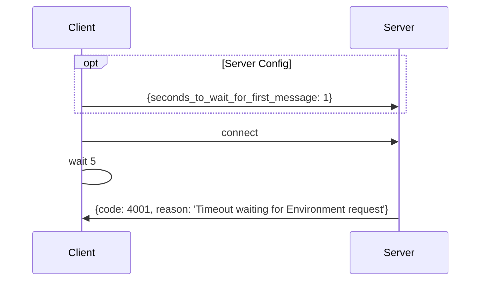
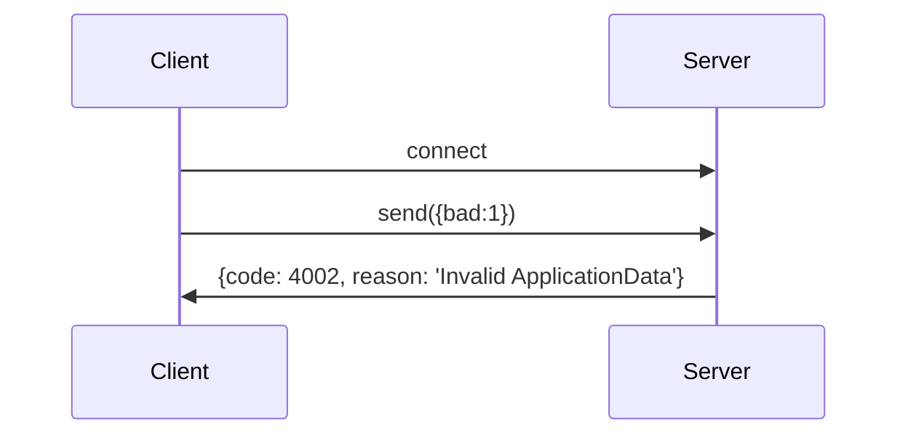
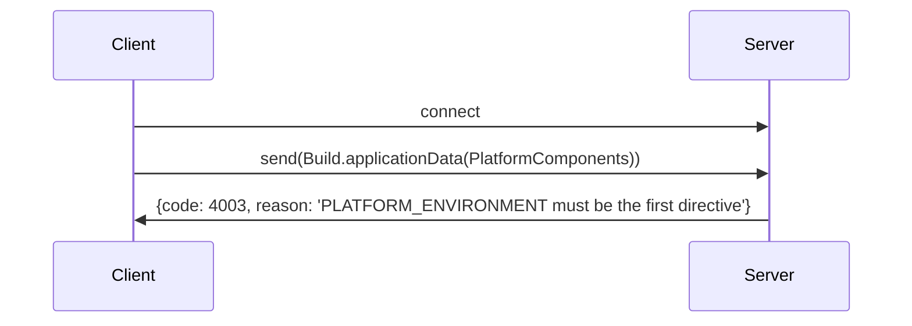
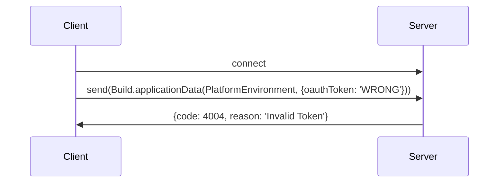
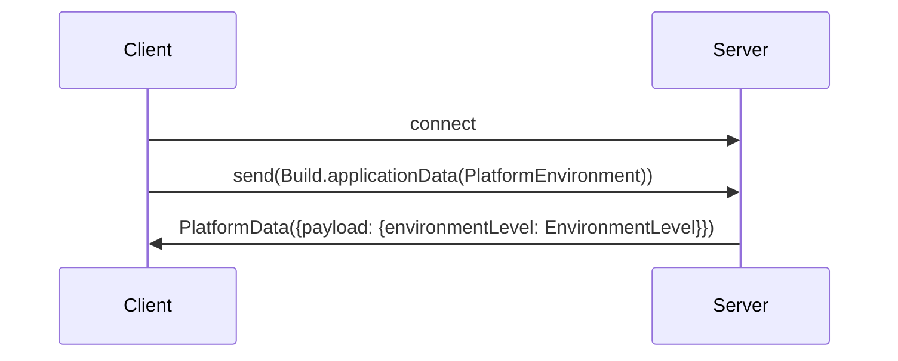
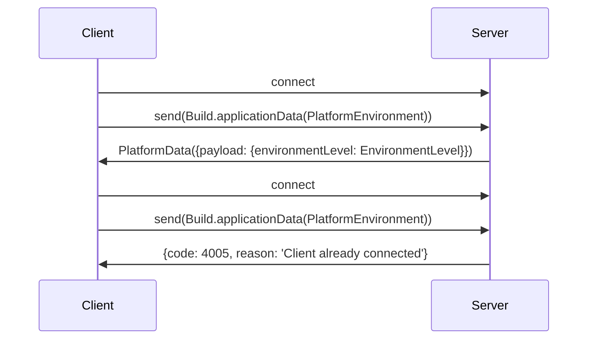
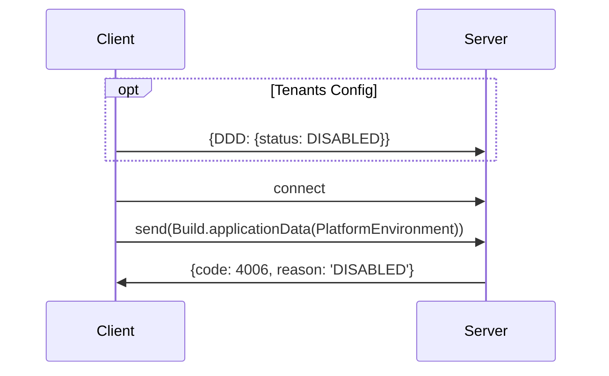

### Timeout waiting for Environment request

### ApplicationData object validation

### First Directive Must Be PLATFORM_ENVIRONMENT

### Invalid OAuth Token

### Successful Connection

### Client already connected

### Tenant DISABLED

